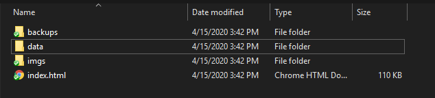

## Simple Python WordCloud/Twitter Scrape

This is a simple application to get a feel for what is trending 
on Twitter on an hourly basis. While I don't use twitter,
I would like to know what the current trends are and to have an idea
of what those trends mean.

As such, this script creates a WordCloud of the given top trends as 
reported by the twitter api, then a WordCloud of a sample of 500 tweets
for each of the top trends. The WordClouds are then placed in a simple html file for
easy perusing. This index is then appended hourly with the top trends while 
the script is running.

The index has limited functionality. Clicking the hyperlink will open twitter with a 
current search for that trend. Clicking the image itself will open Google with a search
for that same trend topic. This can be helpful for more general questions like "What is NCT Dream?"
that may not be apparent from a quick set of tweets.

## Customization

By default, the script only makes secondary clouds for the top 10 trends, and the 
twitter scrape is confined to the US region-- these are easy to change in the code.

## Output

Running wc_main creates output like below:

Opening up the index will give you something like this:

Checking out a particular time:

You can see in this sample output that we're currently in the 2020 election cycle. 
The data being used to create these Clouds is also automatically pickled and saved
off to a data folder so that if a particular trend is worth further investigation, 
we have the data already available. 

Just charting the trends per hour shows some interesting points--- for example, the 
hours from 3-5 am are dominated by K-pop!

  

